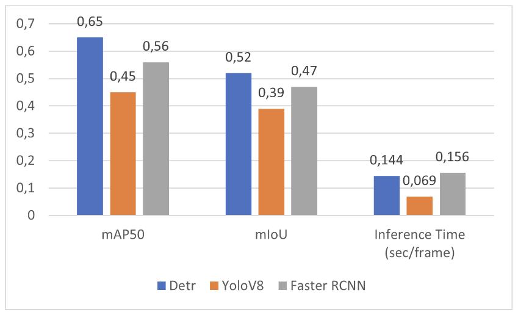
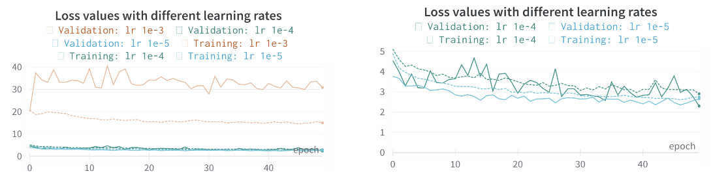

# Object Detection and Tracking Repository

## Overview
This repository contains the implementation of various object detection and tracking tasks. The activities are divided into two main tasks: Object Detection and Object Tracking. Each task includes multiple sub-tasks to evaluate different models, perform data annotation, fine-tune models, and apply cross-validation techniques.

## Task 1: Object Detection

### Task 1.1: Off-the-shelf - Model Comparison
In this task, we evaluate and compare the performance of three popular object detection models: DETR, Faster R-CNN, and YOLOv8. The comparison includes:

- **Model Setup**: Installation and configuration of each model.
- **Performance Evaluation**: Testing the models on a common dataset.
- **Results Comparison**: Analyzing and comparing the accuracy, speed, and other relevant metrics.


**Pretrained models used** :
DETR (Resnet50 backbone): CNN and transformer based model (implementation).
YoloV8 (YoloV8x version): one-stage CNN based model (implementation).
Faster RCNN (Resnet50_FPNv2 backbone): two-stage CNN based model (implementation).

**Implementation details**:
Executed on a RTX 3060.
All of the models were pre-trained on the COCO dataset. 
We selected both parked and non-parked cars and bicycles. 
Only detected bounding boxes with a confidence score greater than 0.5 were used.


<div align="center">
  
</div>


**Conclusions**:
Although YoloV8 had the fastest inference time thanks to being a one-stage CNN, it yielded the worst results. 
Faster RCNN had worse results than DETR, with even longer inference time. 
DETR showed the best performance in terms of mAP and mIoU.

<div align="center">
  
</div>


The results show that both Faster RCNN and DETR networks outperform YoloV8 in terms of predicting more accurate and robust bounding boxes. 
All models struggle to detect distant cars, with YoloV8 performing the worst. 
The networks detect the class bicycle object as only the bicycle, whereas in the ground truth it is annotated with both the bicycle and the person riding it.
Additionally, pretrained models fail to recognize vans and pick-ups as cars, often labeling them as trucks, despite being annotated as cars in the ground truth.


### Task 1.2: Annotation
For this task, we use the Roboflow software to perform data annotation and labeling. This includes:

- **Dataset Preparation**: Gathering and organizing the dataset.
- **Annotation Process**: Using Roboflow to annotate and label the data accurately.
- **Exporting Annotations**: Preparing the labeled data for model training.

### Task 1.3: Fine-tune to Your Data
This task involves fine-tuning the pre-trained models using the annotated dataset from Task 1.2. The steps include:

- **Model Fine-Tuning**: Adjusting the models to better fit the specific dataset.
- **Performance Comparison**: Comparing the fine-tuned models against the pre-trained versions.
- **Analysis**: Evaluating the improvements and identifying any shortcomings.

As shown in task 1.1, our best performing model was the DETR. As it was not too time-consuming, we attempted to fine-tune it using the video frames.
First 25% of frames were used for training and the remaining frames were used for testing.


First 25% of frames were used for training and the remaining frames were used for testing. Hyperparameters used: 
Data augmentation techniques were applied to prevent overfitting, which included: 
Random horizontal flip 
Random resize (with a list of scales ranging from 480 to 800)
Random crop 
AdawW optimizer was used. 
Model was trained for 50 epochs. 
Batch size of 8 was used.

<div align="center">
  
</div>

The learning rate of 1e-3 was found to be too high, causing the loss to explode during the initial epochs. 
The learning rates of 1e-4 and 1e-5 had similar performance. During the initial epochs, the loss was reduced significantly and then stabilized. 
A learning rate of 1e-4 was selected for the next round of training.

| Metric | Improvement |
|--------|-------------|
| mAP50  | +48.3%      |
| mIoU   | +47.5%      |


Data augmentation techniques were applied to prevent overfitting, which included: 
- Random horizontal flip 
- Random resize (with a list of scales ranging from 480 to 800)
- Random crop 
- AdawW optimizer was used. 
- Model was trained for 50 epochs. 
- Batch size of 8 was used.
- Our videos were parsed into COCO format. 
- A single RTX 3090 was used for training. 
- Each training session lasted for 3 hours and 37 minutes. 
- Starting point weights were taken from the COCO dataset. 
- Multiple learning rates were tested during the training process.

### Task 1.4: K-Fold Cross-validation
In this task, we apply K-Fold Cross-validation to the dataset using the sklearn implementation. The steps include:

- **Dataset Splits**: Dividing the dataset into K folds with `shuffle=True` for randomization.
- **Cross-validation Process**: Training and validating the models on each fold.
- **Result Analysis**: Aggregating the results and analyzing the model performance across different folds.

## Task 2: Object Tracking
This task involves implementing object tracking techniques to track detected objects across frames in a video sequence. The steps include:

- **Tracker Setup**: Selecting and configuring object tracking algorithms.
- **Tracking Implementation**: Applying the tracking algorithms to video data.
- **Performance Evaluation**: Assessing the accuracy and robustness of the tracking algorithms.

## Getting Started
To get started with this repository, follow the instructions below:

### Prerequisites
- Python 3.x
- Required libraries: [list of libraries]

### Installation
1. Clone the repository:
   ```sh
   git clone https://github.com/yourusername/object-detection-tracking.git
